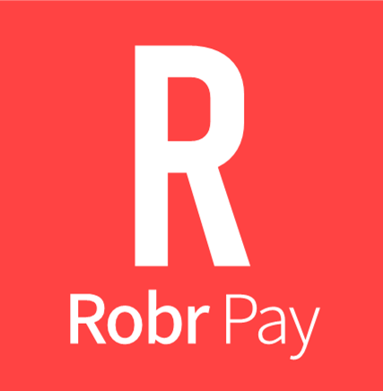

# RobrPay

로버페이, 간편하고, 빠르고, 오픈소스이며, ("그들"에게) 비밀스러운 페이먼트!



## 사용법

원래 목적은 개인적인 사용으로 본인의 친구들 끼리의 대리 결제를 위한 플랫폼 마련이 목표였으나, 만약 님들도 사용하고 싶다면 다음과 같은 절차를 밟으세요.

### node.js 설치

node.js 를 설치하세요. 이 봇은 deprecated 된 punycode 기능을 사용하므로 만약 최신 버전의 node.js 로 작동하지 않는다면 node.js 18을 설치하세요. node version control을 사용하면 좋습니다.

### .env 파일 만들기

루트 폴더에 .env 라는 파일을 만들고 다음을 붙여넣으세요.

```properties
TOKEN=discord bot token
MONGODB_URI=mongodb uri
OWNER_ID=대리결제를 해줄 친구의 디스코드 사용자 ID
```

### 디스코드 봇 만들기

디스코드 개발자 포털에서 디스코드 봇을 만들고 관리자 권한을 부여하세요. 이거 하는 방법은 인터넷에 많음.
디스코드 봇 토큰을 복사하여 `discord bot token`을 지우고 `.env`의 `TOKEN=` 뒤에 붙여넣으세요

### Mongo DB 데이터베이스 구축

Mongo DB Atlas를 이용해 무료 데이터베이스를 구축하세요. 그리고 데이터베이스의 connect 를 눌러 driver를 선택한 후 MongoDB URI를 받으세요.
URI를 `mongodb uri`를 지우고 `MONGODB_URI=` 뒤에 붙여넣으세요.

MongoDB 데이터베이스 접속 비밀번호를 URI의 `<Password>`자리에 붙여넣으세요.

### 배치

친구들끼리 있는 서버에 봇을 초대하고 루트 폴더에서 `node index.js` 를 실행해 봇을 구동하세요.

참고로 회원가입 할 때와 `/terms` 명령어를 치면 나오는 약관은 저만의 (악독한) 약관이므로 다른 약관을 적용하고 싶다면 직접 작성하여 github나 pastebin 같은 곳에 업로드한 다음 `terms.js`와 `register.js`에 있는 URL을 수정해서 사용하세요. 그럼 준비 완료!
